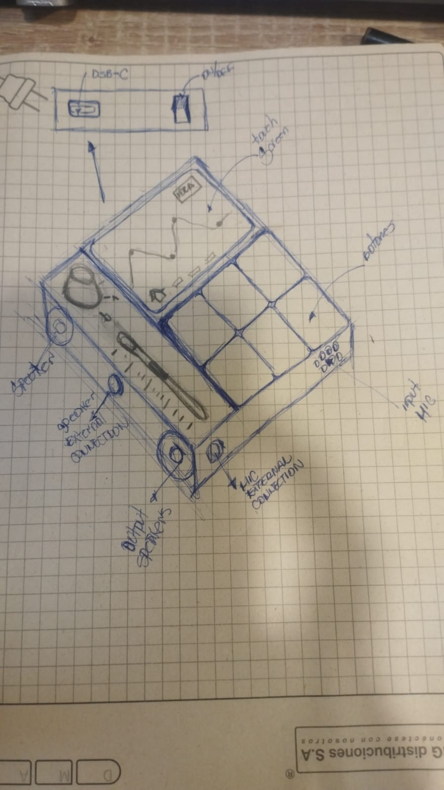
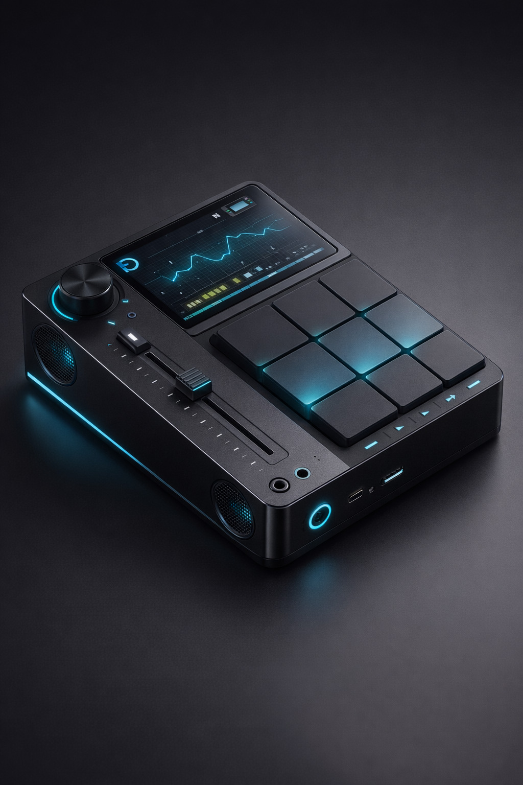
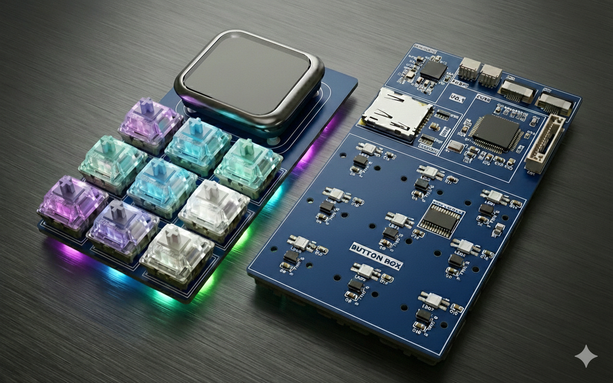

<div align="center">
  
  <h1>MIDI-DANI_DEV</h1>
  <p>
    <strong>Standalone Portable MIDI Controller & Sampler</strong>
  </p>

  <p>
    
    
    
    <br>
    
  </p>
</div>

---
## 👉 [Click Here to see the project in EasyEDA](https://oshwlab.com/caicedo.daniel.dev/midi_dani_dev)
---

## 📢 System Overview

**MIDI-DANI_DEV** is an open-source, portable music production station designed for low-latency performance and high-fidelity sampling. 

---

## 🎨 Project Evolution: From Sketch to Reality

This section visualizes the design journey, bridging the gap between the initial hand-drawn concept, the aesthetic target (AI visualization), and the current engineering reality.

| ✏️ 1. Ideation (Sketch) | 🔮 2. Vision (Design Target) | 🛠️ 3. Implementation (Current Status) |
| :---: | :---: | :---: |
|  |  |  |
| *Original hand-drawn schematic defining user inputs and form factor.* | *AI-generated concept used as a reference for CMF (Color, Material, Finish).* | *Actual ECAD/MCAD integration. PCB routing and component placement in EasyEDA.* |

---

## 🏗️ System Architecture

The system is distributed across three main processing units:

1.  **UI:** display and animations.
2.  **Main MCU:** Handles logic, sensors (Hall), USB stack, and system state.
3.  **Audio DSP:** Manages the codec, signal chain, and Bluetooth streaming.

### Block Diagram

```
                ┌────────────────────┐
                │    TFT Display     │
                │  (Dedicated UI)    │
                └───────┬────────────┘
                        │ SPI / UART
                        ▼
┌────────────────────────────────────────────────┐
│             MAIN MCU (CONTROL LOGIC)           │
│                                                │
│ - Hall Effect Pads (Velocity Sensitive)        │
│ - Rotary Encoders & Linear Pots                │
│ - RGB LED Matrix                               │
│ - USB-C (MIDI + PD + Data)                     │
│ - SD Card File System                          │
│ - System State Machine                         │
└───────────────┬───────────────────┬────────────┘
                │                   │
        Control │                   │ Control
                ▼                   ▼
┌──────────────────────┐   ┌──────────────────────┐
│   AUDIO DSP          │   │   Bluetooth Module   │
│                      │◄──►│   (BLE)             │
│ - Codec Driver       │   │   Wireless Control   │
│ - Signal Routing     │   └──────────────────────┘
│ - Sampler Engine     │
└───────────┬──────────┘
            │ 
            ▼
┌──────────────────────┐
│     Audio Codec      │
│     (ADC + DAC)      │
└───────┬───────┬──────┘
        │       │
   ADC  │       │ DAC
        │       ▼
        │   ┌──────────────┐
        │   │ Class-D Amp  │
        │   └──────┬───────┘
        │          ▼
        │    Internal Speakers
        │   (Active Monitor)
        ▼
   Internal Mic
 (MEMS + Preamp)

```
## 📂 Repository Structure

The project is organized into numbered directories to separate engineering disciplines:

```text
📦 Root
 ┣ 📂 1. Hardware   # Schematics, PCB Layouts, and BOM (KiCad/Altium)
 ┣ 📂 2. Firmware   # Source code for the MCU (STM32 + Docker Build System)
 ┣ 📂 3. Software   # Desktop/Cloud apps, Python scripts, or Dashboards
 ┣ 📂 4. CAD-Model  # 3D Enclosures (STEP/STL) and Mechanical Drawings
 ┣ 📂 5. Docs       # Datasheets, Architecture Diagrams, and Requirements
 ┗ 📜 README.md
```
## 🔊 Audio Subsystem

The device operates in two exclusive audio modes, ensuring signal integrity based on the usage context.

### Active Monitor (Default) 🔊
* **Path:** `DAC` → `Class-D Amplifier` → `Internal Speakers`
* **Use Case:** Live performance, pad drumming, immediate feedback.
* **Latency:** Ultra-low (Hardware native).

### Input Stage (Sampling)
The recording path is always active regardless of the output mode.
* **Sensor:** MEMS Microphone.
* **Conditioning:** Low-noise Op-Amp Preamp → Anti-aliasing LPF → High-res ADC.

> **Note:** We intentionally bypass the internal MCU ADC in favor of a dedicated **Audio Codec** to achieve a professional Signal-to-Noise Ratio (SNR).

---

## ⚡ Power & Electronics

### Power Architecture
* **Source:** USB-C (`5V`) or Li-ion Battery (`3.7V`).
* **Management:** Power Path Management (charging while using).
* **Power Rails:**
    * `3.3V` (Logic/MCUs) - Low noise LDOs.
    * `5.0V` (Display Backlight/LEDs).
    * `Boost V` (Audio Amp) - Dedicated boost converter for headroom.

### Human Interface Devices (HID)
* **Pads:** Hall Effect sensors (magnetic) for non-contact velocity sensitivity and extreme durability (no mechanical wear).
* **Visuals:** Addressable RGB LEDs for quantization feedback and system status.

---

## 🚀 Roadmap (v0.1)

- [x] **Architecture:** Defined Multi-MCU topology.
- [ ] **Power:** USB-C Dual Role implementation plan.
- [ ] **Hardware:**
    - [ ] Analog Front End (Mic Preamp) simulation.
    - [ ] Hall Sensor Pad PCB design.
- [ ] **Firmware:**
    - [ ] Inter-processor communication (SPI/UART) protocol.
    - [ ] Audio buffering strategy.
- [ ] **Mechanical:**
    - [ ] Acoustic chamber design for internal speakers.

---

<div align="center">
  <p>Made with ❤️, ☕, and C++ in Colombia</p>
</div>
